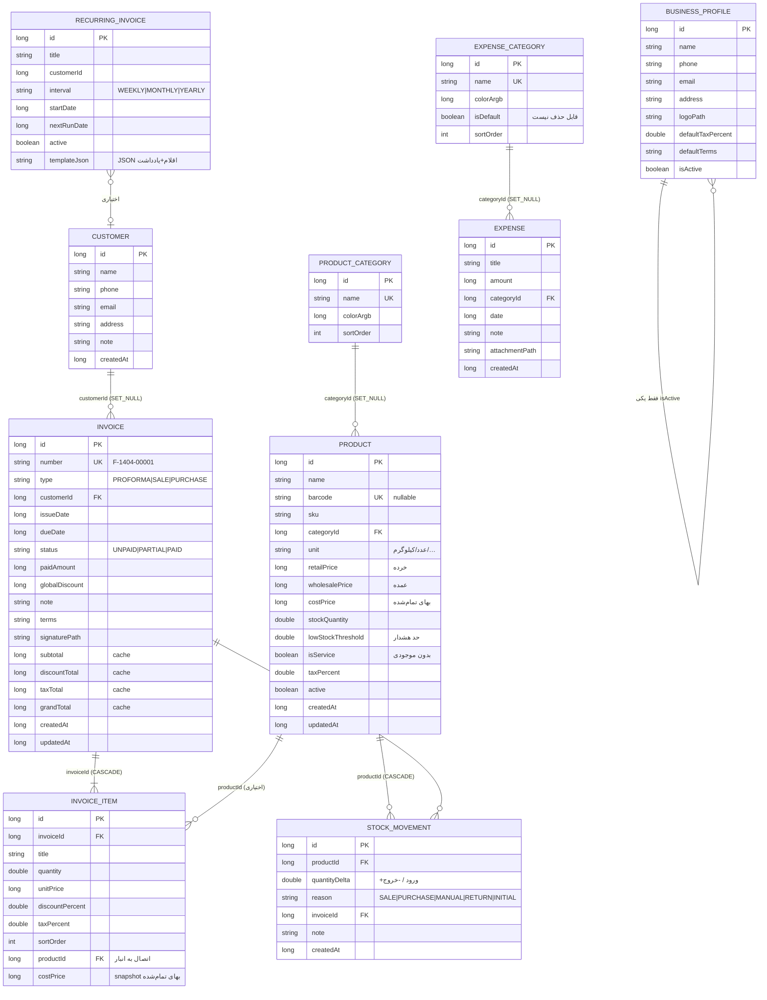
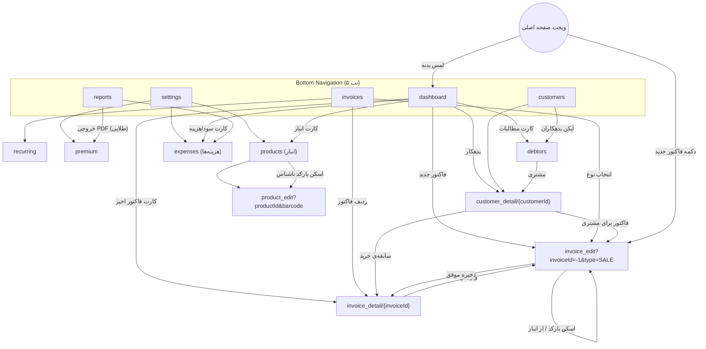

# معماری فاکتوریار (FactorYar)

اپلیکیشن Native اندروید صدور فاکتور — Kotlin + Jetpack Compose، معماری MVVM + Clean Architecture چند‌ماژوله.

## ۱. نقشه ماژول‌ها

```
┌────────────────────────────────────────────────────────────┐
│                            app                             │
│  (MainActivity, NavHost زندهٔ BottomBar, Workers, Hilt root)│
└───────┬──────────┬──────────┬──────────┬──────────┬────────┘
        ▼          ▼          ▼          ▼          ▼
 feature/    feature/   feature/   feature/   feature/    feature/   feature/
 dashboard   invoices   customers  reports    settings    products   expenses
        └──────┬──────────┴──────────┴──────────┴───────────┴──────────┘
               ▼
        core:ui (تم/رنگ، تقویم جلالی UI، کامپوننت‌ها، نمودارها)
               │
   ┌───────────┼──────────┬─────────────┬────────────┬──────────────┐
   ▼           ▼          ▼             ▼            ▼              ▼
core:data  core:billing core:printer core:pdf   core:barcode   core:domain
(Repo impl) (Poolakey)  (ESC/POS BT) (PdfDoc)  (ML Kit/ZXing)  (مدل/UseCase)
   │                                                       ▲      ▲
   ├──── core:database (Room + Entity/DAO + Migration)     │      │
   └──── core:datastore (DataStore تنظیمات/کلید) ──────────┘      │
        core:common (جلالی، فرمت‌دهی فارسی) ─────────────────────┘

ویجت صفحه اصلی (Glance) داخل ماژول `app` قرار دارد و از طریق Hilt EntryPoint
مستقیماً به Repositoryها دسترسی می‌گیرد (ViewModel در Glance وجود ندارد).
```

قانون وابستگی: featureها فقط به `core:domain` (+`core:ui` و ماژول‌های ابزاری مثل `core:pdf`) وابسته‌اند. لایه داده (database/datastore) فقط از طریق `core:data` و Hilt تزریق می‌شود، بنابراین افزودن بک‌اند سروری در فاز ۲ فقط با افزودن یک پیاده‌سازی جدید از Repository انجام می‌شود.

## ۲. مدل دیتابیس Room — نمودار ER



نکته‌ها:
- مقادیر `subtotal/discountTotal/taxTotal/grandTotal` در زمان ذخیره محاسبه و **denormalize** می‌شوند تا گزارش‌های SQL سریع (SUM/GROUP BY) بدون join روی آیتم‌ها اجرا شوند.
- وضعیت «معوق» فیلد نیست؛ از ترکیب `status != PAID AND dueDate < now` مشتق می‌شود.
- دیتابیس با SQLCipher رمزنگاری می‌شود؛ کلید ۲۵۶‌بیتی تصادفی در اولین اجرا ساخته و در DataStore نگه‌داری می‌شود.
- **نسخه دیتابیس ۲** با `MIGRATION_1_2` واقعی (بدون `fallbackToDestructiveMigration`) جدول‌های انبار/هزینه را اضافه می‌کند و ستون‌های `productId`/`costPrice` را به `invoice_items` می‌افزاید — داده کاربران نسخه ۱ حفظ می‌شود.
- `barcode` در سطح Entity `nullable` است تا ایندکس یکتا با چند کالای بدون بارکد نشکند (مپر مقدار خالی را به `null` تبدیل می‌کند).
- `costPrice` روی قلم فاکتور **کپی لحظه‌ای** است؛ تغییر بعدی قیمت خرید، سود فاکتورهای گذشته را دستکاری نمی‌کند.

## ۳. اسکلت Navigation Graph



معرفی کوتاه routeها (`navigation/Routes.kt`):

| Route | مقصد | آرگومان |
|---|---|---|
| `dashboard/invoices/customers/reports/settings` | تب‌های اصلی | — |
| `invoice_edit?invoiceId={id}&type={type}` | فرم صدور/ویرایش | `invoiceId=-1 → جدید` |
| `invoice_detail/{invoiceId}` | پیش‌نمایش/اشتراک/چاپ | Long |
| `customer_detail/{customerId}` | دفتر حساب مشتری | Long |
| `recurring` | فاکتورهای دوره‌ای | — |
| `premium` | صفحه اشتراک | — |
| `products` | لیست انبار + اسکن بارکد | — |
| `product_edit?productId={id}&barcode={code}` | تعریف/ویرایش کالا | `productId=-1 → جدید`، `barcode` پیش‌پر از اسکن |
| `expenses` | ثبت هزینه‌ها + خلاصه سود و زیان | — |
| `debtors` | فهرست بدهکاران + یادآوری | — |

## ۴. جریان ذخیره فاکتور (مهم‌ترین جریان)

1. `InvoiceEditViewModel` فرم را با `EditableItem`های متنی نگه می‌دارد (پشتیبانی از ارقام فارسی در ورودی).
2. `SaveInvoiceUseCase → InvoiceRepositoryImpl.saveInvoice` در یک `Room.withTransaction`:
   - اگر فاکتور جدید است: شماره از DataStore (`consumeNextNumber`) خوانده و شمارنده +1 می‌شود؛ فرمت: `{prefix}-{سال شمسی}-{پنج رقم}`.
   - `InvoiceCalculator` جمع‌ها را محاسبه می‌کند؛ در Invoice ذخیره می‌شود.
   - آیتم‌ها با `onDelete = CASCADE` بازنویسی می‌شوند.

## ۴.۱ همگام‌سازی خودکار انبار

هنگام `saveInvoice` داخل همان تراکنش:

1. اگر فاکتور در حال **ویرایش** است، `revertInvoiceEffect(invoiceId)` همه حرکات انبار قبلی آن فاکتور را برعکس اعمال و حذف می‌کند (جلوگیری از کسر دوباره).
2. برای هر قلم دارای `productId`، `costPrice` از انبار خوانده و روی قلم snapshot می‌شود.
3. اثر انبار اعمال می‌شود:
   - **فاکتور فروش** → `stockQuantity -= quantity` (`reason = SALE`)
   - **فاکتور خرید** → `stockQuantity += quantity` (`reason = PURCHASE`) و `costPrice` کالا با قیمت خرید جدید به‌روز می‌شود
   - **پیش‌فاکتور** → هیچ اثری روی انبار ندارد
4. حذف فاکتور نیز ابتدا اثر انبار را برمی‌گرداند، سپس رکورد را پاک می‌کند.

خدمات (`isService = true`) از کسر موجودی معاف‌اند. فروش بیش از موجودی **مسدود نمی‌شود** (موجودی منفی مجاز است) اما در فرم فاکتور هشدار قرمز نمایش داده می‌شود — چون در کسب‌وکارهای کوچک ایران فروش پیش از ثبت خرید رایج است.

## ۴.۲ محاسبه سود واقعی

| شاخص | فرمول | منبع |
|---|---|---|
| درآمد (Revenue) | `SUM(grandTotal)` فاکتورهای فروش | `invoices` |
| بهای تمام‌شده (COGS) | `SUM(quantity × costPrice)` اقلام فاکتور فروش | `invoice_items` |
| سود ناخالص | `درآمد − COGS` | محاسبه در Domain |
| هزینه‌های عمومی | `SUM(amount)` هزینه‌های بازه | `expenses` |
| **سود خالص** | `سود ناخالص − هزینه‌های عمومی` | `ProfitReport` |

سری زمانی نمودار به‌صورت هوشمند انتخاب می‌شود: بازه ≤ ۴۵ روز → سطل روزانه، بیشتر → سطل ماهانه شمسی. نمودار `ComparisonBarChart` سه سری (درآمد/هزینه/سود خالص) را گروهی رسم می‌کند و مقادیر منفی (زیان) زیر خط صفر می‌روند.

## ۴.۳ اسکن بارکد بدون وابستگی به Google Play Services

```
BarcodeAnalyzer (CameraX ImageAnalysis)
   ├─ ۱) ML Kit نسخه bundled  ← مدل داخل APK، بدون نیاز به GMS
   ├─ ۲) در صورت خطا → سوییچ خودکار و دائمی به ZXing (PlanarYUVLuminanceSource)
   └─ ۳) نبود دوربین/رد مجوز → ورود دستی بارکد در همان دیالوگ
```

`MlKitAvailability` با `Class.forName` در رانتایم بررسی می‌کند کلاس‌های ML Kit قابل بارگذاری هستند یا نه. کاربر در همه حالت‌ها می‌تواند کالا را ثبت کند — این برای انتشار در کافه‌بازار/مایکت که کاربران زیادی گوشی بدون GMS دارند حیاتی است.

جریان اسکن:
- **در صفحه انبار:** بارکد پیدا شد → باز کردن کالا؛ پیدا نشد → فرم کالای جدید با بارکد پیش‌پر.
- **در فرم فاکتور:** بارکد پیدا شد → افزودن قلم (اگر تکراری بود فقط تعداد +۱)؛ پیدا نشد → Snackbar اطلاع‌رسانی.

## ۴.۴ یادآوری بدهی مشتریان

- `DebtorRepositoryImpl` از `observeOpenReceivables()` (فاکتورهای فروش با `grandTotal > paidAmount`) فهرست بدهکاران را می‌سازد و برای هرکدام مبلغ معوق، تعداد فاکتور معوق و **بیشترین روز تأخیر** را محاسبه می‌کند.
- مرتب‌سازی: بیشترین مبلغ / بیشترین تأخیر / نام.
- `ReminderMessageBuilder` در لایه Domain متن مؤدبانه فارسی می‌سازد (قالب‌بندی پول و تاریخ به‌صورت تابع تزریق می‌شود تا Domain به اندروید وابسته نشود). حداکثر ۵ فاکتور فهرست و بقیه خلاصه می‌شود.
- ارسال با **Share Intent استاندارد** (واتساپ/تلگرام/…) یا `smsto:` مستقیم؛ متن قبل از ارسال قابل ویرایش است. هیچ سرور یا SDK پیام‌رسانی درگیر نیست.

## ۴.۵ ویجت صفحه اصلی (Glance)

- `FactorYarWidget` (Glance) + `FactorYarWidgetReceiver` در مانیفست.
- داده از `WidgetEntryPoint` (Hilt `@EntryPoint`) خوانده می‌شود چون Glance ViewModel ندارد.
- نمایش: نام کسب‌وکار، تاریخ شمسی، **فروش امروز**، تعداد فاکتور امروز، **تعداد فاکتور معوق**.
- دکمه «+ فاکتور جدید» با deep link `factoryar://widget/new_invoice` مستقیم فرم فاکتور را باز می‌کند.
- **پیروی از تم کاربر:** رنگ اصلی از `ThemePreset`/رنگ سفارشی DataStore و حالت روشن/تاریک از `ThemeMode` (یا سیستم) خوانده می‌شود.
- به‌روزرسانی: `WidgetRefresher` جریان داشبورد و تنظیمات را با `debounce(500)` رصد می‌کند + `WidgetRefreshWorker` هر ۳۰ دقیقه به‌عنوان پشتیبان.

## ۵. سیستم تم

- `ThemePreset` ۵ تم آماده + CUSTOM.
- `ColorSchemeFactory` با دستکاری HSL از یک Seed، کل توکن‌های M3 (primary/secondary/tertiary/containers/surfaces) را برای روشن و تاریک مشتق می‌کند — معادل سبک Material You بدون وابستگی کتابخانه‌ای.
- تنظیمات در DataStore؛ `MainActivity` با `collectAsStateWithLifecycle` گوش می‌دهد و تم بلافاصله بدون ری‌استارت اعمال می‌شود.
- Color Picker آزاد (HSV) فقط برای اشتراک طلایی.

## ۶. چاپ/PDF/اشتراک‌گذاری

- **PDF:** `PdfDocument` اندروید؛ چندصفحه‌ای، جدول اقلام، لوگو، امضا، واترمارک رایگان.
- **ESC/POS:** رسید به Bitmap سیاه‌سفید (۳۸۴/۵۷۶ پیکسل) رندر و با دستور `GS v 0` رگرسیون‌گرافیک ارسال می‌شود؛ آدرس MAC آخرین چاپگر ذخیره می‌شود.
- **اشتراک:** Share Intent استاندارد با FileProvider — تلگرام/واتساپ/ایمیل.

## ۷. Poolakey (بازار)

Skuها: `factoryar_gold_monthly` / `factoryar_gold_yearly` — قبل از انتشار در پنل بازار ساخته و کلید RSA در `BillingManager` جای‌گذاری شود. فلگ `isPremium` در DataStore ذخیره می‌شود تا قابلیت‌ها آفلاین هم کار کنند.

## ۸. ورکرهای WorkManager

| Worker | دوره | کار |
|---|---|---|
| RecurringInvoiceWorker | روزانه | صدور خودکار فاکتورهای سررسید + نوتیفیکیشن |
| OverdueReminderWorker | هفتگی | یادآوری بدهی معوق (نام بدهکار + روز تأخیر) |
| BackupWorker | هفتگی | بک‌آپ ZIP محلی در صورت فعال‌بودن |
| LowStockWorker | روزانه | هشدار کالاهای رو به اتمام |
| WidgetRefreshWorker | هر ۳۰ دقیقه | به‌روزرسانی ویجت صفحه اصلی |

کانال‌های نوتیفیکیشن: `recurring_invoices`، `auto_backup`، `debt_reminders`، `stock_alerts`.

## ۹. مدل درآمدی (به‌روزشده)

| قابلیت | رایگان | طلایی |
|---|:--:|:--:|
| فاکتور نامحدود، CRM، چاپ بلوتوثی، اشتراک‌گذاری | ✅ | ✅ |
| **مدیریت موجودی و بارکد** | ✅ | ✅ |
| **ثبت هزینه‌ها و سود خالص ساده** | ✅ | ✅ |
| **یادآوری بدهی به مشتری** | ✅ | ✅ |
| **ویجت صفحه اصلی** | ✅ | ✅ |
| ۵ تم آماده | ✅ | ✅ |
| خروجی CSV/Excel | ✅ | ✅ |
| گزارش PDF حرفه‌ای | ❌ | ✅ |
| انتخابگر رنگ آزاد (HSV) | ❌ | ✅ |
| حذف واترمارک | ❌ | ✅ |
| پشتیبان‌گیری ابری | ❌ | ✅ |
| چند کسب‌وکار | ❌ | ✅ |
